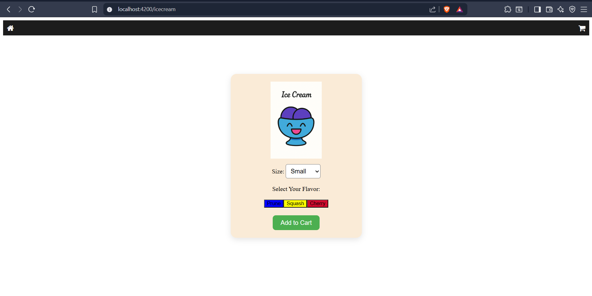
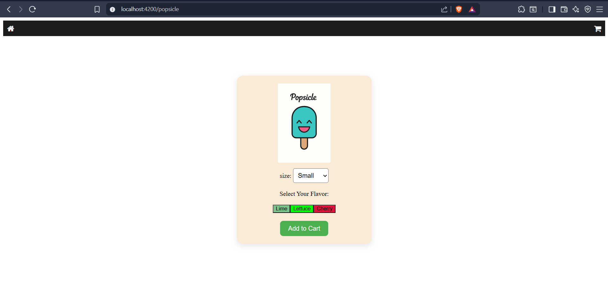
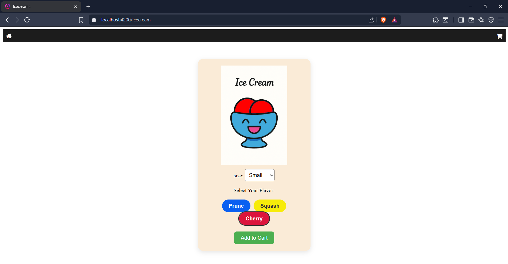
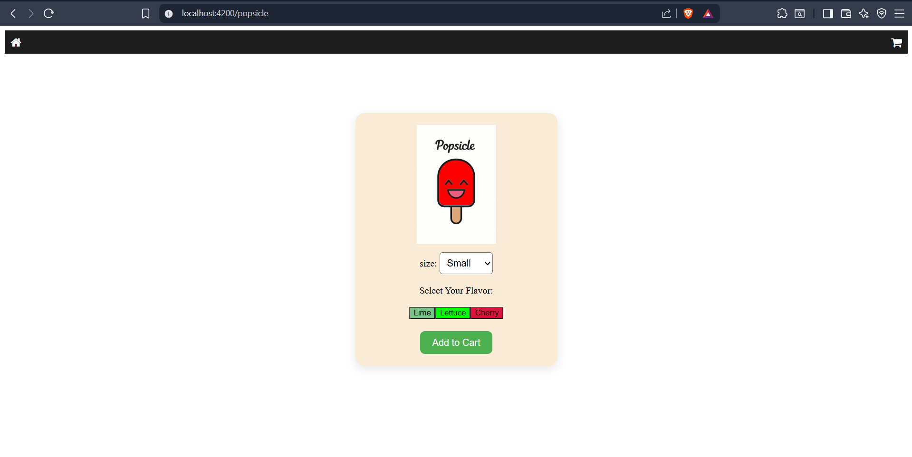
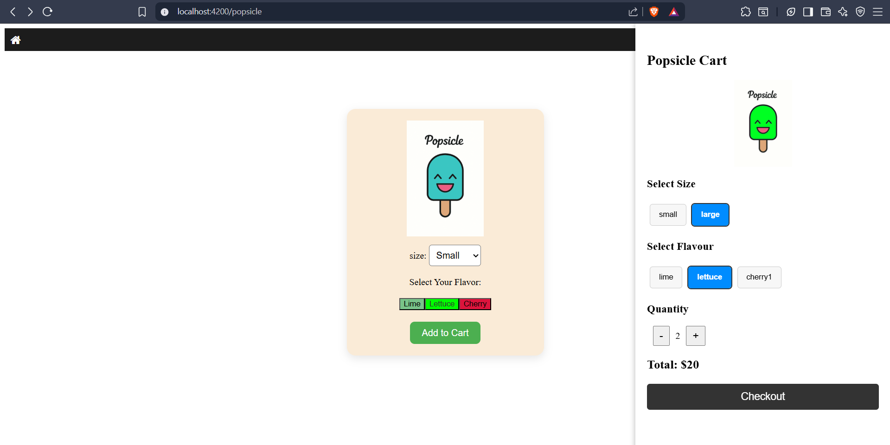
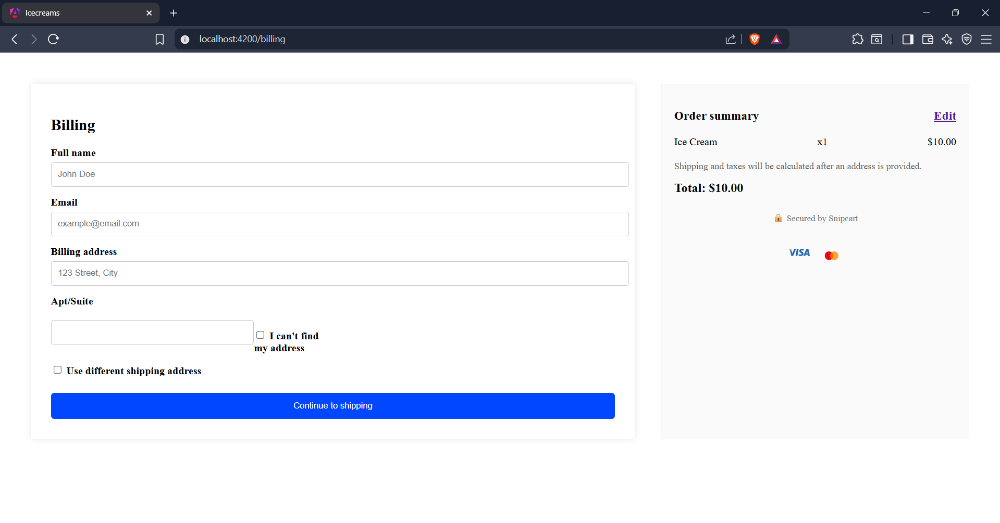
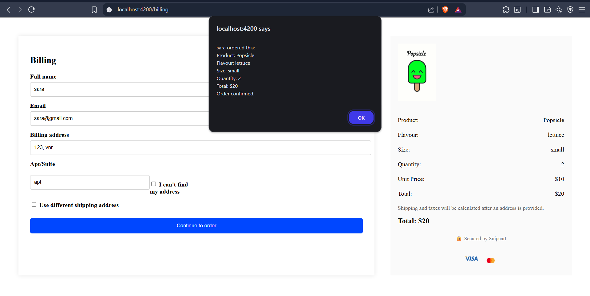

# 🍦 Angular Cart App

A simple and interactive cart application built with **Angular**, showcasing ice cream and popsicle selection, flavor customization, size-based pricing, cart handling, and billing page. 🎯


---

## 🛍️ Features

- 🧁 **Ice Cream & Popsicle Pages** – Choose flavors and sizes dynamically
- 💸 **Dynamic Pricing** – Size-based and quantity-based cart pricing
- 🛒 **Cart Popup** – Real-time cart updates with quantity edits
- 🧾 **Billing Page** – Form submission with total summary
- 🎨 **Image Swap** – Flavor-based image changes

---

## 📂 Project Structure

```plaintext
src/
├── app/
│   ├── components/
│   │   ├── home/
│   │   ├── ice-cream/
│   │   ├── popsicle/
│   │   ├── cart-popup/
│   │   └── billing/
│   ├── services/
│   └── app-routing.module.ts
├── assets/
│   └── images/
├── environments/
└── index.html
```

## 🔧 Technologies Used
* Angular 17+

* TypeScript

* Html+Css

* Bootstrap (Optional)

* VS Code

## 📸 Screenshots


------------------------------------

------------------------------------

------------------------------------

------------------------------------

------------------------------------

------------------------------------

------------------------------------

## 🙌 Author
Made with ❤️ by Sarathy Murugan
